# TextileFlow

Tekstil B2B sipariş yönetimi — alıcı ile üretici arasındaki dağınık iletişimi tek mobil uygulamada toplar.

> **Future Talent bootcamp** bitirme projesi.

**Teknoloji özeti:** Flutter (Android + Web) · Supabase (PostgreSQL, Auth, RLS, Storage) · Firebase FCM · FastAPI + Gemini 2.5 Flash *(opsiyonel «AI ile düzenle»)*

## İçindekiler

- [Canlı demo](#canlı-demo)
- [Bölüm 1 — Uygulama](#bölüm-1--uygulama)
- [Bölüm 2 — Teknik](#bölüm-2--teknik)
- [Lokal kurulum](#lokal-kurulum)
- [Deploy](#deploy)
- [Dokümantasyon](#dokümantasyon)

Giriş ekranı sade; e-posta ve şifre yeterli. Uygulama sizi alıcı mı üretici mi olduğunuza göre doğru panele yönlendirir.

<p align="center">
  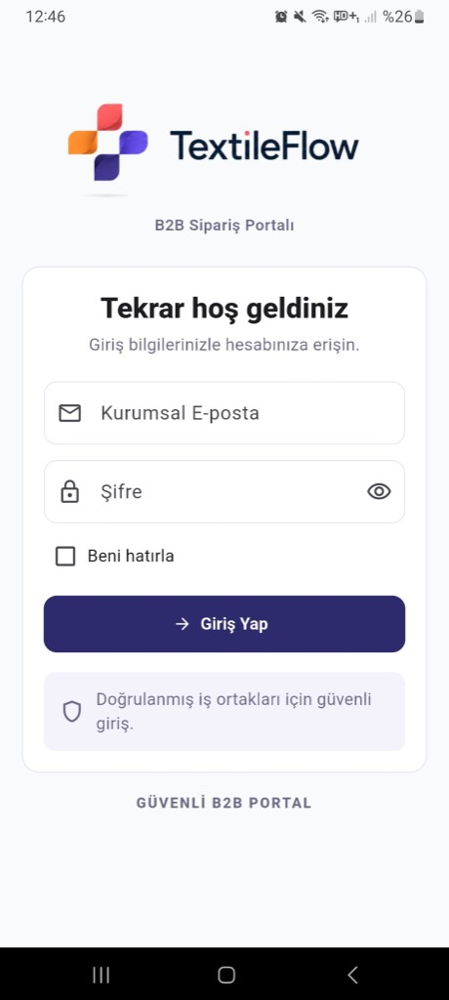
</p>

<p align="center"><em>Kurumsal e-posta ile giriş — rol (alıcı / üretici) arka planda belirlenir.</em></p>

---

## Canlı demo

| | Adres |
|---|---|
| **Web** *(uygulama girişi)* | [b2b-orderflow.vercel.app](https://b2b-orderflow.vercel.app) |
| **AI asistan API** *(opsiyonel; «AI ile düzenle» butonları — giriş adresi değil)* | [b2b-orderflow.onrender.com/health](https://b2b-orderflow.onrender.com/health) |
| **Kaynak kod** | [github.com/beyzaayiigit/B2B-OrderFlow](https://github.com/beyzaayiigit/B2B-OrderFlow) |

**Demo hesapları** (Supabase Auth):

| Rol | E-posta |
|---|---|
| Alıcı | `buyer@demo-textileflow.test` |
| Üretici | `producer@demo-textileflow.test` |

> Giriş bilgileri demo videoda gösterilir.

---

# Bölüm 1 — Uygulama

Aşağıda uygulamayı **kullanıcı gözüyle** geziyoruz: önce üretici, sonra alıcı tarafı. Her bölümde ekranlardan önce kısa bir açıklama var; teknik detaylar [Bölüm 2](#bölüm-2--teknik)'de.

## Ne yapıyor?

TextileFlow, tekstilde alıcı ile üretici arasındaki sipariş trafiğini tek yerde toplar — katalog, matris sipariş, durum takibi, talep yazışması ve (isterseniz) AI destekli not düzenleme.

- **Alıcı:** model seçer, renk × beden matrisiyle sipariş verir, süreci izler.
- **Üretici:** siparişleri onaylar, üretimi yönetir, sevk eder, kataloğu günceller.
- **İkisi de:** push bildirimi alır; talepler kayıt altında kalır.

Aynı uygulama **Android APK** ve **web**'de çalışır.

---

## Üretici paneli

Üretici giriş yaptığında karşısına dört ana sekme çıkar: Gelenler, Üretim, Sevk, Katalog. Siparişler buradan onaylanır, üretime alınır ve sevk edilir.

### Gelen siparişler

Alıcıdan düşen siparişler burada toplanır. **Tümü**, **Bekliyor** ve **Onaylandı** filtreleriyle hangi işin sırada olduğunu bir bakışta görürsünüz; kartlardaki renkli rozetler durumu özetler.

<p align="center">
  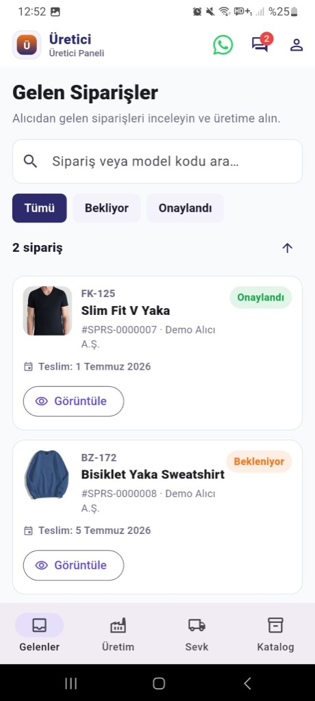
  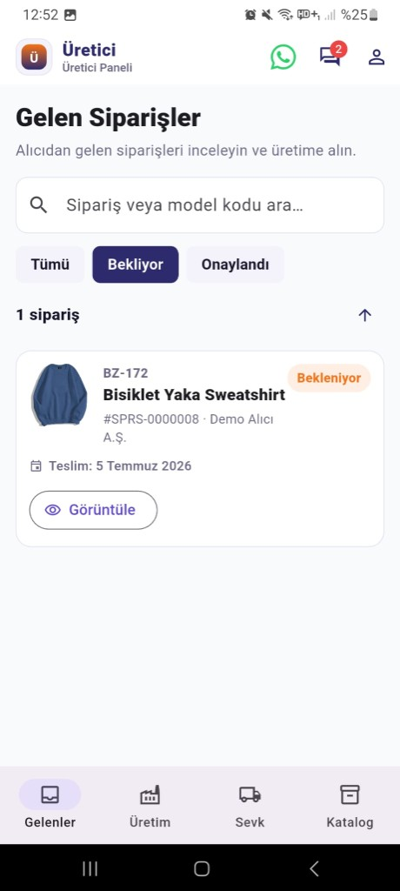
  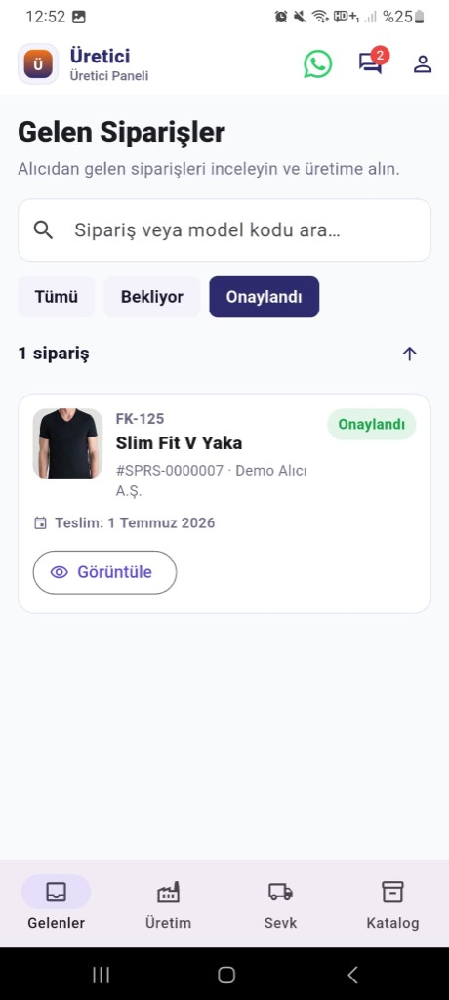
</p>

Bir siparişe girdiğinizde model fotoğrafı, teslim tarihi, sipariş notu ve renk-beden dağılımı aynı ekranda açılır. «Üretime al» demeden önce matrisi kontrol etmek için yeterli.

<p align="center">
  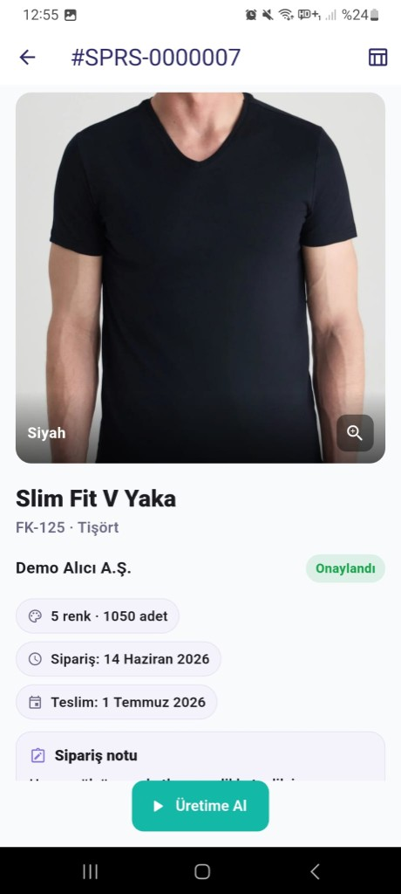
  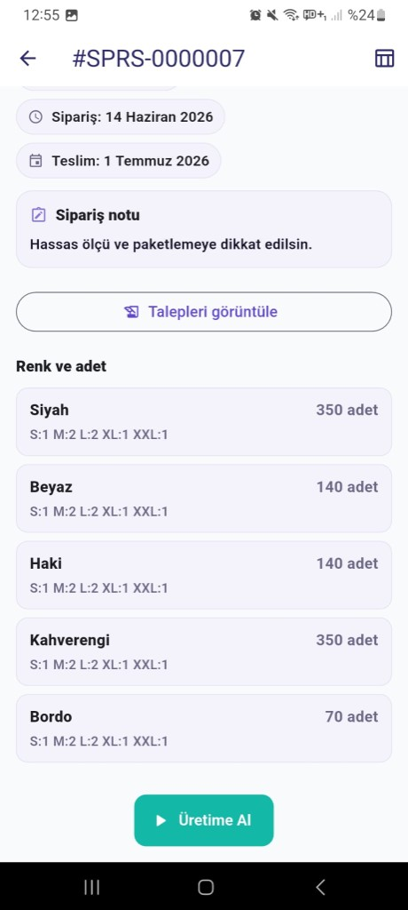
</p>

### Üretim yönetimi

Onaylanıp üretime alınan siparişler bu sekmede yaşar. Kesim, dikim, paketleme gibi aşamalar güncellenir; hazır olunca **Sevke hazır** ile bir sonraki adıma geçilir.

<p align="center">
  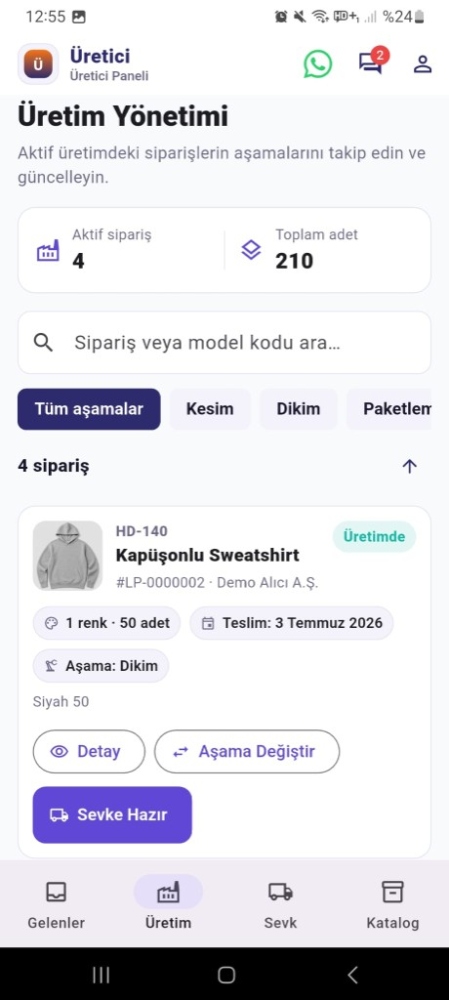
</p>

### Sevk — sipariş detayı

Sevk edilmiş bir siparişe baktığınızda sipariş tarihi, teslim tarihi, varsa sipariş notu ve **Talepleri görüntüle** ile geçmiş alıcı talepleri tek yerden okunur.

<p align="center">
  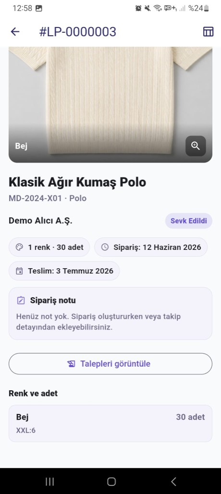
</p>

### Katalog yönetimi

Üretici kendi modellerini buradan yönetir: taslak / yayında durumu, renk varyantları, galeri veya kameradan görsel yükleme. Üstteki **görsel depolama** çubuğu, Supabase Storage kotanızda ne kadar yer kaldığını gösterir.

<p align="center">
  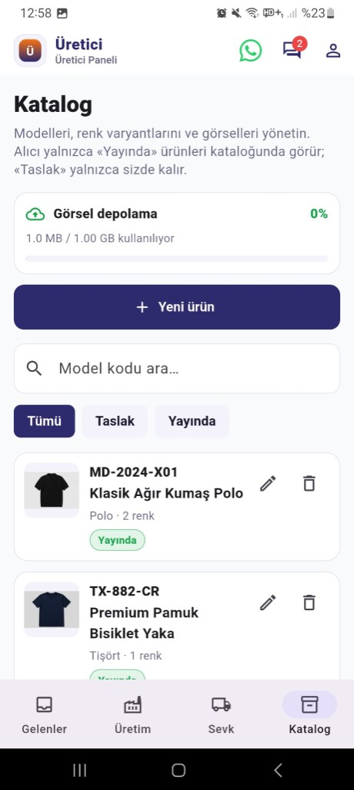
  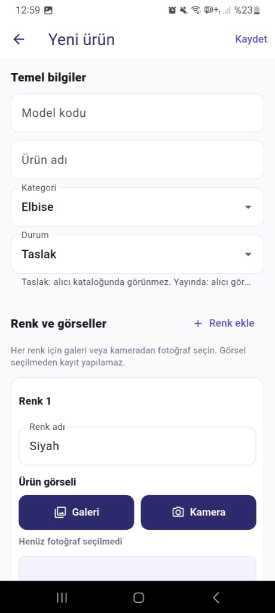
</p>

### Alıcı güncelleme talepleri

Alıcı siparişte değişiklik istediğinde üst bardaki talepler ikonuna düşer. Hangi siparişte yanıt beklediğiniz turuncu **Yanıt gerekli** rozetiyle belli olur; buradan thread'e girip onaylayabilir veya geri bildirim verebilirsiniz.

<p align="center">
  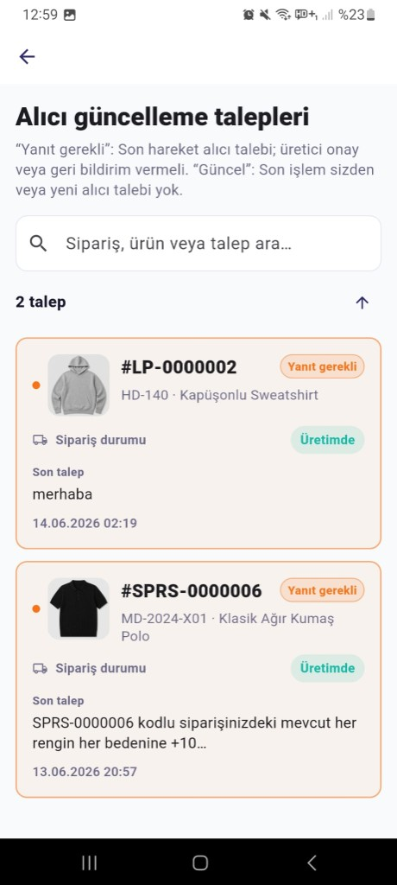
</p>

---

## Alıcı paneli

Alıcı tarafında dört sekme var: Katalog, Sipariş, Takip, Sevk. Sipariş vermek ve süreci izlemek bu akış üzerinden ilerler.

### Katalog

Yayındaki modeller burada listelenir; renk görselleri arasında kaydırarak gezebilir, model koduyla arama yapabilirsiniz. Beğendiğiniz üründen doğrudan siparişe geçilir.

<p align="center">
  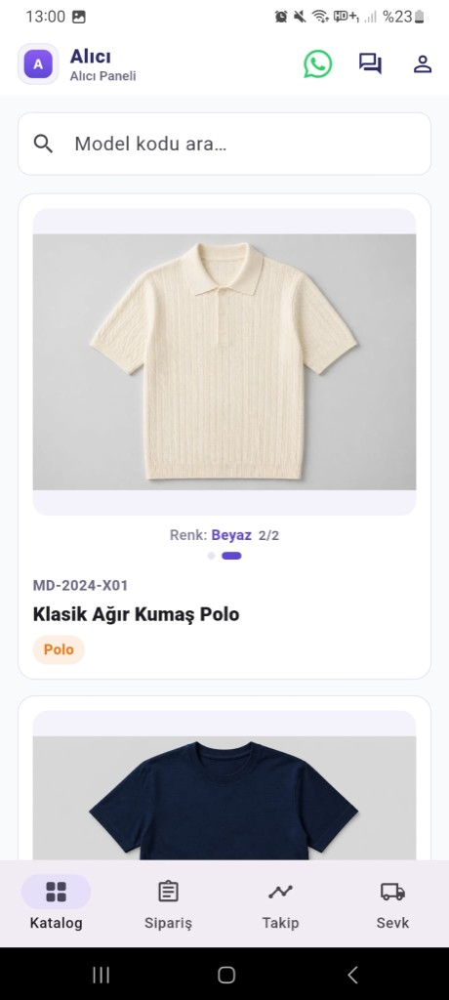
</p>

### Sipariş oluşturma

Sipariş üç adımda kurulur: model ve renkler, beden oranları / seri hesabı, teslim tarihi ve üreticinin göreceği not. Not alanında **AI ile düzenle** dağınık cümleyi toparlayıp Excel'e de gidecek net bir metne çevirir — zorunlu değil, ama işinizi kolaylaştırır.

<p align="center">
  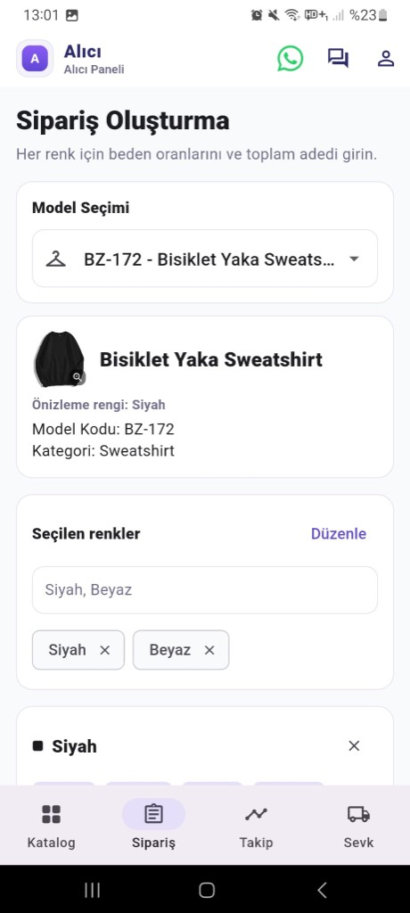
  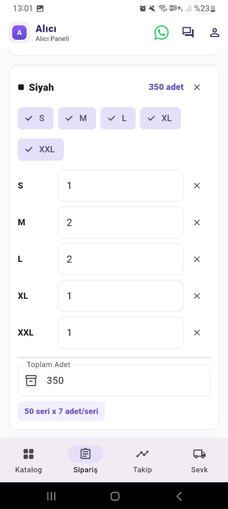
  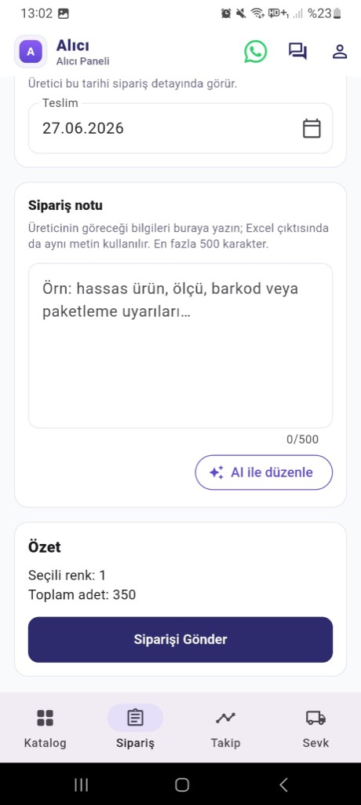
</p>

### Sipariş takibi

Verdiğiniz siparişlerin durumu burada. Listeden bir koda tıklayınca zaman çizelgesi (bekleniyor → onaylandı → üretimde …) açılır; üretimdeyken **güncelleme talebi** yazıp geçmiş mesajları da aynı sipariş altında takip edebilirsiniz.

<p align="center">
  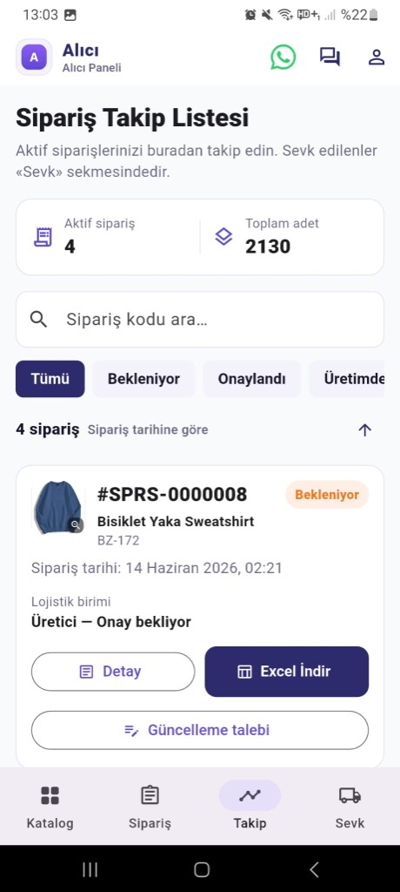
  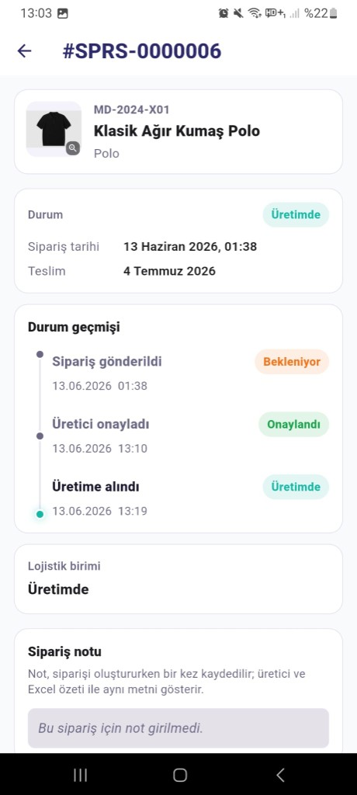
  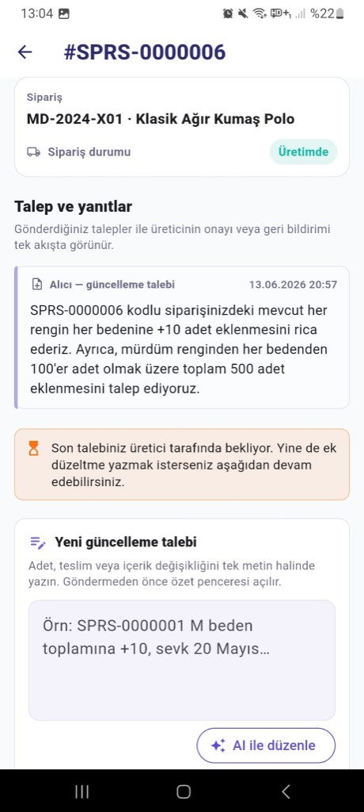
</p>

### Sevk edilenler

Üretici sevk ettiğinde sipariş bu sekmeye düşer. Özet karttan **Excel indir** veya detaya girip durum geçmişine bakabilirsiniz — «kargoya çıktı mı?» sorusunun cevabı burada.

<p align="center">
  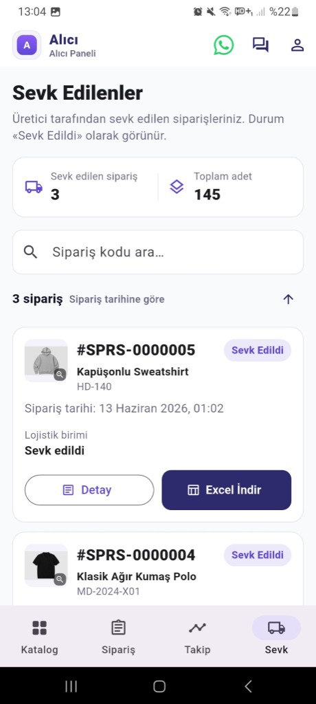
  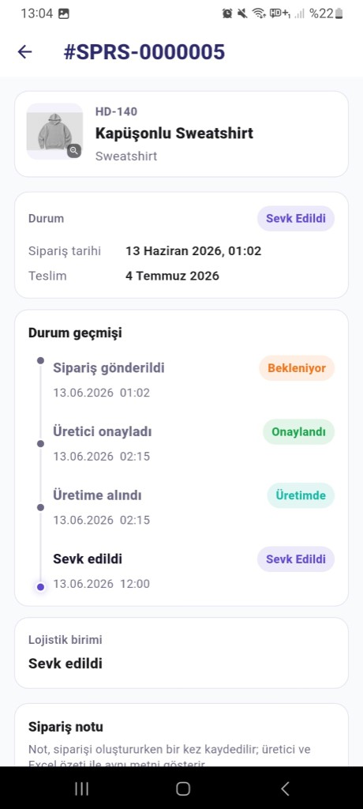
</p>

---

## Hesap yönetimi

Profil bilgileri, aktif oturum ve şifre değiştirme ekranı. Demo hesaplarda da gerçek Supabase Auth akışı çalışır; şifre güncellemesi modal üzerinden yapılır.

<p align="center">
  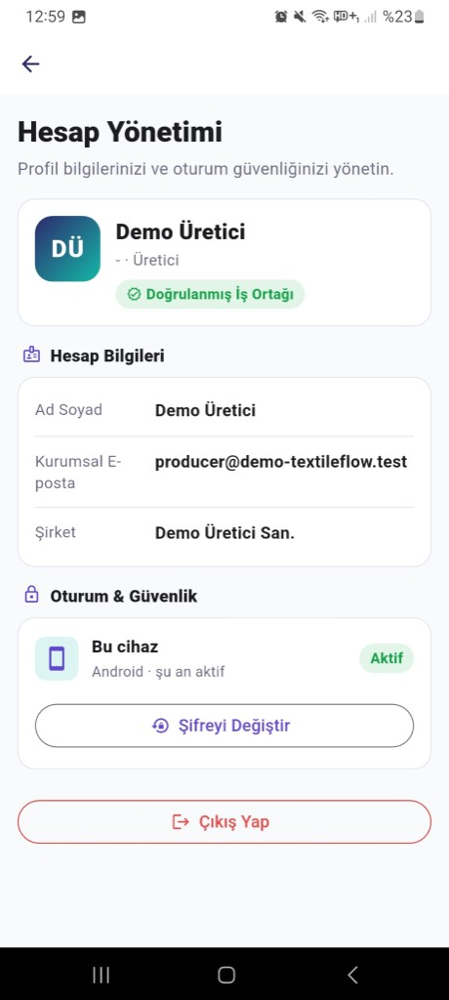
  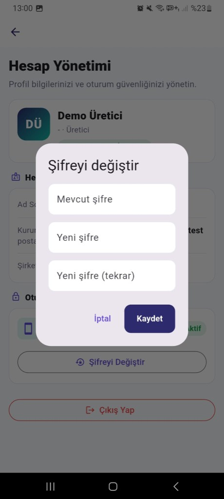
</p>

---

# Bölüm 2 — Teknik

Bu bölüm **mimari**, **repo yapısı** ve **kurulum** için.

## Mimari özeti

```
Flutter (Android + Web)
    │
    ├── Supabase ── PostgreSQL + RLS + Auth + Storage
    │       └── Edge Functions (push, Excel)
    │
    ├── Firebase FCM ── push bildirimleri
    │
    └── FastAPI + Gemini 2.5 Flash ── «AI ile düzenle» (opsiyonel)
```

**Karar:** İş verisi ve güvenlik Supabase'te. FastAPI yalnızca LLM asistanı; genel CRUD orada değil. `API_BASE_URL` tanımlı değilse AI butonları gizlenir, çekirdek akış etkilenmez.

---

## Frontend (`frontend/`)

| | |
|---|---|
| **Framework** | Flutter (Dart 3.11+), Android + Web |
| **Durum** | Riverpod |
| **Navigasyon** | go_router — rol bazlı shell (alıcı / üretici) |
| **Backend SDK** | supabase_flutter |
| **Bildirim** | firebase_messaging |
| **Ortam** | flutter_dotenv → `frontend/.env` (git'e girmez) |

**Mimari:** feature-first — `lib/features/{auth,catalog,orders,requests,producer}/` altında `presentation · application · domain · data`.

**Öne çıkan modüller:**

- `orders` — sipariş oluşturma, takip, durum zaman çizelgesi, Excel indirme
- `producer` — gelen siparişler, üretim aşaması, sevk, katalog admin, depolama kotası
- `requests` — alıcı/üretici talep thread'leri
- `core/llm/assist_api.dart` — Render'daki FastAPI'ye ince istemci

---

## Database (`database/`)

| | |
|---|---|
| **Motor** | PostgreSQL (Supabase) |
| **Güvenlik** | Row Level Security — şirket bazlı veri izolasyonu |
| **Migration'lar** | `001_core.sql` … `012_catalog_categories.sql` |
| **Politikalar** | `policies/001_rls.sql`, `002_storage_rls.sql` |
| **Seed** | `seeds/dev_seed.sql` — demo şirketler ve katalog |

**Ana tablolar:** `companies`, `profiles`, `catalog_products`, `catalog_categories`, `orders`, `order_lines`, `order_status_events`, `update_requests`, `device_tokens`

**Sipariş kodu:** `SPRS-` öneki + sequence (`order_code_seq`).

---

## Backend

### Supabase Edge Functions (`backend/functions/`)

| Fonksiyon | Görev |
|---|---|
| `send-push` | FCM HTTP v1 ile push kuyruğu |
| `generate-order-excel` | Sipariş özeti Excel (.xlsx), gömülü görsel |

Secrets: Supabase project secrets + Firebase servis hesabı.

### AI servisi (`backend/api/`)

| | |
|---|---|
| **Stack** | FastAPI, uvicorn, google-genai |
| **Model** | `gemini-2.5-flash` |
| **Deploy** | Render (`backend/api`, Python 3) |
| **Ortam** | `GEMINI_API_KEY`, `GEMINI_MODEL`, `ALLOWED_ORIGINS` |

**Uç noktalar:**

- `GET /health`
- `POST /assist/order-note`
- `POST /assist/update-request`

---

## Proje yapısı

```
TextileFlow/
├── frontend/              # Flutter uygulaması
├── backend/
│   ├── api/               # FastAPI + Gemini
│   └── functions/         # Supabase Edge Functions
├── database/
│   ├── migrations/
│   ├── policies/
│   └── seeds/
├── docs/screenshots/      # README görselleri
└── prodocs/               # PRD, tech-stack, ilerleme kaydı
```

---

## Lokal kurulum

### 1. Ortam dosyaları

```bash
cp frontend/.env.example frontend/.env
cp backend/api/.env.example backend/api/.env
```

`frontend/.env`: `SUPABASE_URL`, `SUPABASE_ANON_KEY`, (opsiyonel) `API_BASE_URL`  
`backend/api/.env`: `GEMINI_API_KEY`

### 2. Supabase

Migration'ları sırayla çalıştır. Auth'ta demo kullanıcıları oluştur, `dev_seed.sql` ile profilleri eşle.

### 3. Flutter

```bash
cd frontend
flutter pub get
flutter run              # Android
flutter run -d chrome    # Web
```

### 4. AI servisi (opsiyonel)

```bash
cd backend/api
uv run uvicorn app.main:app --reload --port 8000
```

---

## Deploy

| Bileşen | Platform |
|---|---|
| Web | Vercel — root `frontend/`, `bash vercel_build.sh`, output `build/web` |
| AI API | Render — root `backend/api`, Python |
| Veri | Supabase (cloud) |
| APK | `flutter build apk --release` |

Vercel ortam değişkenleri: `SUPABASE_URL`, `SUPABASE_ANON_KEY`, `STORAGE_QUOTA_BYTES`, `API_BASE_URL`

---

## Dokümantasyon

- [PRD](prodocs/PRD.md) — ürün gereksinimleri
- [Tech Stack](prodocs/tech-stack.md) — sürüm ve kütüphane detayı
- [Progress](prodocs/Progress.md) — geliştirme günlüğü

---

## Not

Eğitim / bootcamp demo amaçlıdır. `.env`, `google-services.json` ve service role anahtarları repoya **girmez**; yalnızca `.env.example` şablonları commit edilir.

---

> **Geliştirici:** Beyza Yiğit · Future Talent Modül 301 — Yapay Zeka ile Ürün Geliştirme Bootcamp · 2026
